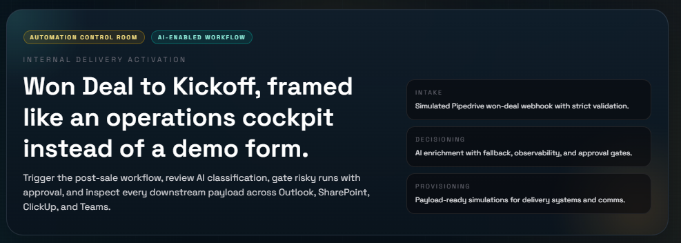
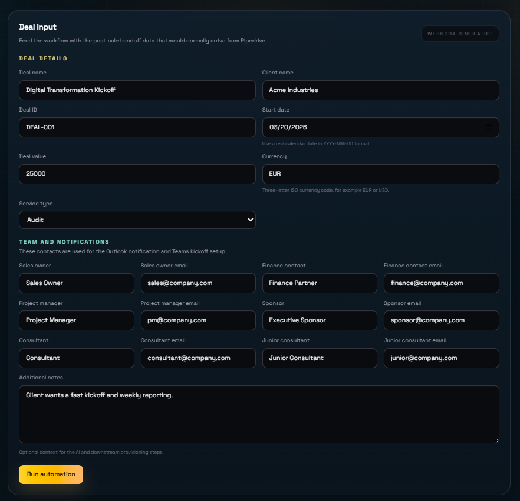
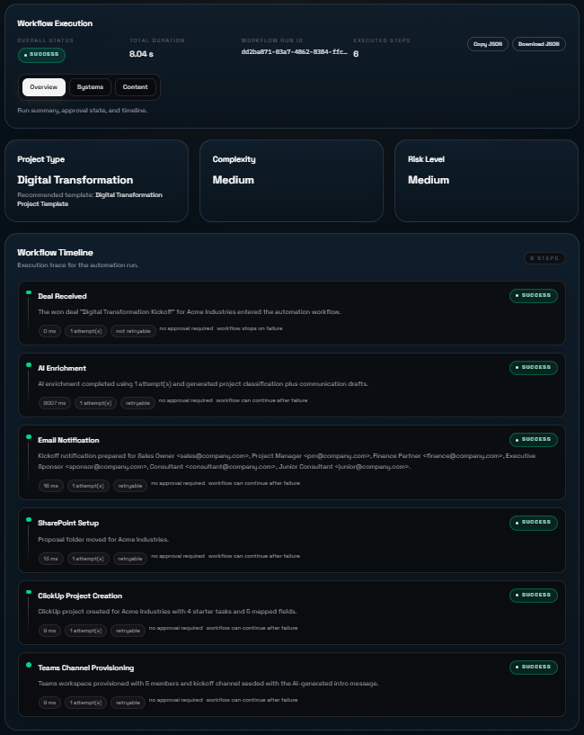
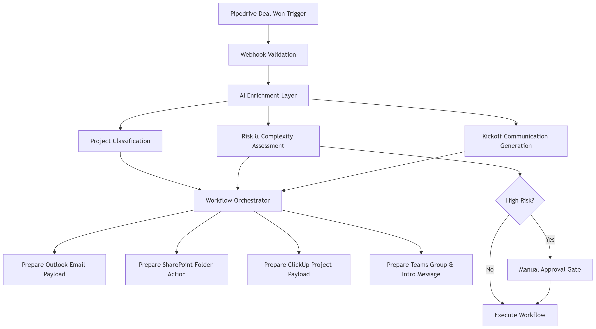

# AI-Enabled Internal Automation Workflow

AI-assisted workflow orchestration for automatically starting projects when a **deal is marked as "won" in Pipedrive**.

This project was built as part of the **AI-Enabled Frontend & Development Accelerator challenge**, focusing on designing and implementing an intelligent automation workflow that integrates multiple systems and uses AI to reduce manual work.

---

# Important Note: Prototype vs Production Integrations

This repository implements a **production-oriented prototype**.

The workflow orchestration, validation logic, AI enrichment and approval controls are **fully implemented and functional**.

However, the downstream integrations with external systems are **currently simulated** in order to keep the implementation within the time scope of the challenge.

The system already prepares **realistic payloads compatible with the target APIs**, meaning the mocks can be replaced with real integrations with minimal effort.

### Currently simulated integrations

- Outlook (Office365 email notifications)
- SharePoint folder management
- ClickUp project creation
- Microsoft Teams group creation

### Production evolution

To move this solution to production, the mocks would be replaced with:

- Microsoft Graph API (Outlook / SharePoint / Teams)
- ClickUp REST API
- Persistent workflow state and audit logs
- Authentication and permission controls

---

# Live Demo

Demo deployment:

https://frontend-assessment-internal-automa.vercel.app/

---

# Demo (GIF)

---

# Application Interface

---

# Workflow Overview

This application simulates a **Pipedrive webhook trigger** and runs an automated workflow that prepares all required downstream actions for starting a new project.

Main flow:

1. Pipedrive deal moves to **"won"**
2. Webhook is received and validated
3. Deal data is enriched using **AI**
4. Risk and complexity are classified
5. Kickoff communication is generated
6. Downstream system payloads are prepared
7. Approval gate is applied when needed

---

# Workflow Diagram

---

# Architecture Overview

The architecture separates responsibilities into three main layers:

### 1. Trigger Layer

Receives and validates the webhook from Pipedrive.

Responsibilities:

- validate webhook payload
- detect transition to "won"
- ensure idempotency
- normalize deal information

---

### 2. AI Enrichment Layer

Processes the deal using an LLM.

AI responsibilities:

- classify project type
- estimate project complexity
- detect potential risks
- generate kickoff email content
- generate Teams introduction message
- suggest initial project tasks

The system supports any **OpenAI-compatible API**, including:

- OpenAI
- OpenRouter
- local models

---

### 3. Workflow Orchestration Layer

Coordinates downstream actions.

Responsibilities:

- determine correct project template
- prepare system payloads
- apply approval gates for high-risk deals
- expose results through the UI

---

# Compliance with Challenge Requirements

| Challenge Requirement | Status | Implementation |
|---|---|---|
| Trigger when deal becomes "won" in Pipedrive | Implemented | Simulated webhook endpoint with validation |
| Send notification email (Office365 / Outlook) | Simulated | Payload prepared for Microsoft Graph API |
| Move or copy SharePoint folder | Simulated | Folder action prepared via Graph payload |
| Create ClickUp project with initial tasks | Simulated | Project and task payload generated |
| Create Teams group and introduction message | Simulated | Group provisioning payload prepared |
| Use AI agent for automation | Implemented | AI classifies deals and generates content |
| Workflow diagram | Implemented | Diagram included in `/docs` |
| README with documentation | Implemented | Setup, architecture and AI explanation |

The solution demonstrates the **complete workflow architecture** while keeping external integrations mocked for development speed.

---

# AI Usage in the Workflow

AI is used at multiple stages of the automation.

### AI responsibilities

- classify project type
- assess risk level
- determine project complexity
- generate kickoff email
- generate Teams introduction message
- suggest initial ClickUp tasks

### AI Output Validation

AI responses are validated before being used.

The system applies:

- schema validation
- fallback values
- approval gates for high-risk results

This ensures the workflow remains **predictable and controllable**.

---

# Approval Gate

When AI detects a deal with **high complexity or risk**, the workflow requires **manual approval** before continuing.

This ensures that automation does not create projects with incorrect configurations.

The UI allows users to:

- inspect the AI classification
- review generated communications
- approve or reject the workflow

---

# Test Coverage

This project includes tests to ensure reliability of the automation logic.

### Unit tests

Unit tests validate:

- webhook parsing
- AI output validation
- workflow orchestration logic
- payload generation

### Integration tests

Integration tests verify:

- full workflow execution
- approval gate logic
- fallback behaviour when AI fails

Tests ensure the system remains stable even when AI responses are unpredictable.

---

# Technology Stack

- Next.js
- React
- TypeScript
- OpenAI compatible APIs
- Zod validation
- TailwindCSS
- Vitest

---

# Project Structure

src
 ├─ app
 │   └─ api
 │       └─ webhook
 │
 ├─ components
 │
 ├─ lib
 │   ├─ ai
 │   ├─ workflow
 │   └─ validation
 │
 ├─ types
 │
docs
 ├─ workflow-diagram.png
 ├─ demo.gif
 └─ app-interface.png

---

# Setup

### 1 Install dependencies

npm install

### 2 Environment variables

Create `.env.local`

OPENAI_API_KEY=your_key_here
OPENAI_BASE_URL=https://openrouter.ai/api/v1

### 3 Run the development server

npm run dev

Application will run at:

http://localhost:3000

---

# Running Tests

npm run test

---

# Production Evolution

If this system were deployed in production, the next steps would include:

- real Microsoft Graph integration
- real ClickUp API integration
- persistent workflow state
- audit logging
- authentication and role-based approvals
- stronger idempotency guarantees

---

# Operational Considerations

Real-world automation systems must be designed not only for functionality but also for **reliability and operational safety**.

This prototype already includes several design choices that make the workflow robust.

### Idempotency

Webhook events can be delivered multiple times.

The workflow validates the transition to `won` and uses an idempotency strategy to prevent duplicate executions.

In a production system this would be reinforced with a **persistent idempotency store** (e.g., Redis or database).

---

### AI Reliability

LLM outputs are inherently non-deterministic.

To ensure safe automation, the system applies:

- schema validation of AI responses
- fallback defaults when AI fails
- approval gates for high-risk classifications

This prevents invalid AI responses from propagating into downstream systems.

---

### Approval Gate

High-risk or complex projects require **manual approval** before downstream actions execute.

This ensures human oversight for automation decisions that may impact multiple systems.

---

### Observability

Automation workflows must be observable to allow debugging and monitoring.

The UI provides visibility into:

- deal classification
- generated communications
- prepared system payloads

In production this would be extended with:

- structured logging
- workflow execution traces
- alerting for failed runs

---

### Failure Recovery

Automation systems should support safe recovery when something fails.

A production implementation would include:

- retry mechanisms for external APIs
- dead-letter queues for failed workflows
- manual resume capabilities

This allows workflows to recover without manual reconstruction.

---

# Conclusion

This project demonstrates how **AI-assisted automation** can streamline internal processes by combining webhook triggers, intelligent classification and orchestrated integrations.

The architecture prioritizes:

- reliability
- observability
- controllability
- extensibility

making it suitable to evolve from prototype to production with minimal changes.
