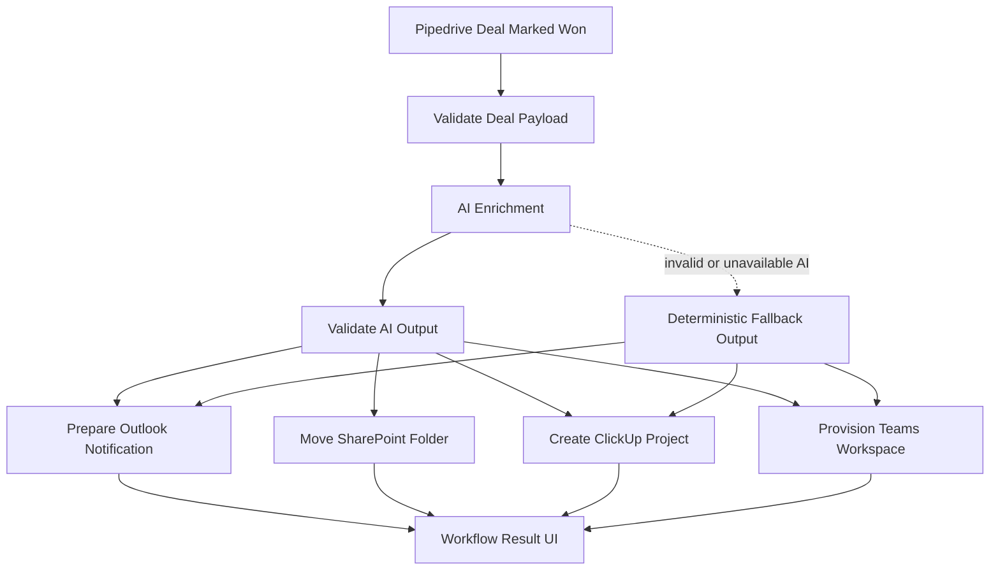

# Frontend Assessment Internal Automation

AI-enabled internal automation prototype for the "Automacao de Processos Internos" challenge. The app simulates what happens after a Pipedrive deal is marked as won: AI enrichment, email preparation, SharePoint folder movement, ClickUp project creation, and Teams workspace provisioning.

## Scope

This repository implements:

- A manual won-deal simulator UI
- A workflow orchestration layer for downstream system actions
- An AI enrichment step using an OpenAI-compatible API
- Structured validation for inbound deal payloads and AI output
- Mocked Outlook, SharePoint, ClickUp, and Teams provisioning payloads

This repository intentionally does not implement live external integrations. The downstream systems are simulated, but the payloads are shaped to resemble realistic requests.

## Workflow Diagram

See [docs/workflow-diagram.md](C:/Users/adria/Desktop/Projects/Assessments/frontend-assessment-internal-automation/docs/workflow-diagram.md) for the standalone diagram.



## Setup

### Prerequisites

- Node.js 20+
- npm
- An OpenAI-compatible API key if you want live AI enrichment

### Environment Variables

Create `.env.local` with:

```env
OPENAI_API_KEY=your_api_key_here
OPENAI_BASE_URL=https://openrouter.ai/api/v1
OPENAI_MODEL=openai/gpt-4o-mini
```

Notes:

- `OPENAI_BASE_URL` can point to OpenAI or OpenRouter.
- If `OPENAI_API_KEY` or `OPENAI_MODEL` is missing, the app falls back to deterministic local enrichment so the workflow still runs.

### Install And Run

```bash
npm install
npm run dev
```

Open `http://localhost:3000`.

### Quality Checks

```bash
npm run lint
npm run build
```

## How The Prototype Works

### 1. Trigger

The challenge trigger is "deal moved to won in Pipedrive". In this prototype, that event is simulated through a form where the operator enters the won deal details and team members.

### 2. Validation

Before the workflow runs:

- The form validates required fields inline
- API routes validate incoming payloads again
- The AI response is parsed and validated before it is trusted

Files:

- [src/lib/validations/deal-schema.ts](C:/Users/adria/Desktop/Projects/Assessments/frontend-assessment-internal-automation/src/lib/validations/deal-schema.ts)
- [src/lib/validations/ai-output-schema.ts](C:/Users/adria/Desktop/Projects/Assessments/frontend-assessment-internal-automation/src/lib/validations/ai-output-schema.ts)

### 3. AI Enrichment

The AI step generates:

- Project classification
- Risk and complexity
- Recommended delivery template
- Kickoff email content
- Teams welcome message
- Suggested ClickUp starter tasks

If the model is unavailable or returns invalid JSON, the system falls back to deterministic enrichment logic.

Files:

- [src/lib/ai/prompts.ts](C:/Users/adria/Desktop/Projects/Assessments/frontend-assessment-internal-automation/src/lib/ai/prompts.ts)
- [src/lib/ai/openai.ts](C:/Users/adria/Desktop/Projects/Assessments/frontend-assessment-internal-automation/src/lib/ai/openai.ts)

### 4. Downstream System Simulations

After enrichment, the workflow simulates:

- Outlook notification preparation
- SharePoint folder movement
- ClickUp project creation with mapped fields and starter tasks
- Teams workspace provisioning with owners, members, channel, and welcome message

Files:

- [src/lib/workflow/process-deal.ts](C:/Users/adria/Desktop/Projects/Assessments/frontend-assessment-internal-automation/src/lib/workflow/process-deal.ts)
- [src/lib/workflow/mocks.ts](C:/Users/adria/Desktop/Projects/Assessments/frontend-assessment-internal-automation/src/lib/workflow/mocks.ts)

### 5. Workflow Result UI

The UI shows:

- Timeline of workflow steps
- Project classification summary
- Outlook payload
- SharePoint result
- ClickUp payload and starter tasks
- Teams payload and members
- Generated AI artifacts

Files:

- [src/components/workflow/DealInputForm.tsx](C:/Users/adria/Desktop/Projects/Assessments/frontend-assessment-internal-automation/src/components/workflow/DealInputForm.tsx)
- [src/components/workflow/WorkflowResult.tsx](C:/Users/adria/Desktop/Projects/Assessments/frontend-assessment-internal-automation/src/components/workflow/WorkflowResult.tsx)
- [src/components/workflow/WorkflowTimeline.tsx](C:/Users/adria/Desktop/Projects/Assessments/frontend-assessment-internal-automation/src/components/workflow/WorkflowTimeline.tsx)

## Technical Architecture

### Layers

1. UI
2. API routes
3. Workflow orchestration
4. AI enrichment
5. Mock external systems

### Repository Structure

```text
src/
  app/
    api/
      ai/enrich-deal/route.ts
      pipedrive-webhook/route.ts
    globals.css
    layout.tsx
    page.tsx
  components/
    workflow/
  lib/
    ai/
    validations/
    workflow/
  types/
```

### API Endpoints

- `POST /api/pipedrive-webhook`
  - Validates the deal payload
  - Runs the full workflow
  - Returns workflow results for the UI

- `POST /api/ai/enrich-deal`
  - Validates the deal payload
  - Runs only the AI enrichment step
  - Returns the structured AI output

## AI Report

### Where AI Enters The Workflow

AI runs after deal validation and before downstream system provisioning.

It is responsible for:

- Classifying the project
- Estimating complexity and risk
- Selecting a recommended template
- Drafting the kickoff email
- Drafting the Teams intro message
- Suggesting initial ClickUp tasks

### What Is Automated By AI

- Content generation
- Project classification
- Initial operational recommendations

### What Is Automated Deterministically

- Payload validation
- Fallback output generation
- Email recipient construction
- SharePoint source and destination paths
- ClickUp field mapping and payload assembly
- Teams owners, members, and channel payload assembly

### What Would Require Human Confirmation In Production

The current prototype runs automatically after validation. In a production workflow, the following would be strong approval points:

- Confirming the generated kickoff email before send
- Confirming the recommended project template when risk is high
- Reviewing ClickUp tasks for unusual deal types
- Reviewing Teams membership for sensitive or client-facing projects

A pragmatic production rule would be:

- Low or medium risk deals: auto-proceed
- High risk deals: require human approval before downstream provisioning

## Mocked Payloads By System

### Outlook

The mock returns a payload shaped like an Outlook/Graph send-mail request:

- `message.subject`
- `message.body`
- `toRecipients`
- `ccRecipients`
- `saveToSentItems`

### ClickUp

The mock returns a payload including:

- Project name
- Space and folder
- Owner
- Start date
- Tags
- Custom fields
- Starter tasks with priority and dates

### Teams

The mock returns a payload including:

- Team display name
- Description
- Visibility
- Owners
- Members
- Kickoff channel
- Welcome message

## Limitations

- No live Pipedrive webhook adapter yet
- No real Microsoft Graph or ClickUp integration
- No persistence or audit log
- No authentication or role-based approval flow
- No automated test suite yet

## Recommended Next Steps

1. Add a real Pipedrive webhook adapter and event mapping.
2. Add automated tests for validation and workflow orchestration.
3. Add explicit approval gates for high-risk deals.
4. Add observability for step duration, failures, and fallback usage.
5. Replace mocks with real Outlook, SharePoint, Teams, and ClickUp integrations.
