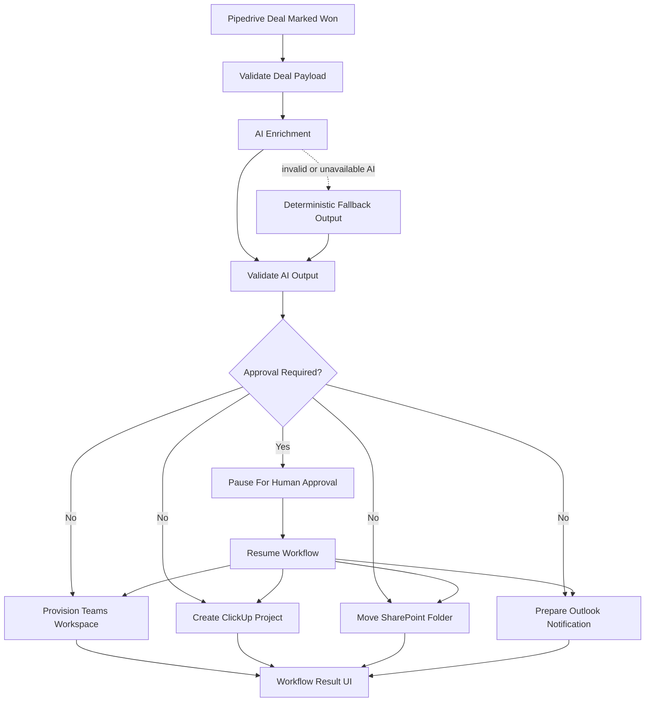

# Frontend Assessment Internal Automation

AI-enabled internal automation prototype for the "Automacao de Processos Internos" challenge. The app simulates what happens after a Pipedrive deal is marked as won: AI enrichment, email preparation, SharePoint folder movement, ClickUp project creation, and Teams workspace provisioning.

## Scope

This repository implements:

- A manual won-deal simulator UI that emits a simulated Pipedrive `updated.deal` webhook
- A workflow orchestration layer for downstream system actions
- An explicit integration-provider boundary between orchestration and downstream systems
- An AI enrichment step using an OpenAI-compatible API
- Structured validation for inbound deal payloads and AI output
- Mocked Outlook, SharePoint, ClickUp, and Teams provisioning payloads
- Automated tests for validation, AI fallback, webhook mapping, and orchestration resilience

This repository intentionally does not implement live external integrations. The downstream systems are simulated, but the payloads are shaped to resemble realistic requests.

## Workflow Diagram

See [docs/workflow-diagram.md](C:/Users/adria/Desktop/Projects/Assessments/frontend-assessment-internal-automation/docs/workflow-diagram.md) for the standalone diagram.



## Setup

### Prerequisites

- Node.js 20+
- npm
- An OpenAI-compatible API key if you want live AI enrichment

### Environment Variables

Create `.env.local` with:

```env
OPENAI_API_KEY=your_api_key_here
OPENAI_BASE_URL=https://openrouter.ai/api/v1
OPENAI_MODEL=openai/gpt-4o-mini
```

Notes:

- `OPENAI_BASE_URL` can point to OpenAI or OpenRouter.
- If `OPENAI_API_KEY` or `OPENAI_MODEL` is missing, the app falls back to deterministic local enrichment so the workflow still runs.

### Install And Run

```bash
npm install
npm run dev
```

Open `http://localhost:3000`.

### Quality Checks

```bash
npm test
npm run lint
npm run build
```

## How The Prototype Works

### 1. Trigger

The challenge trigger is "deal moved to won in Pipedrive". In this prototype, that event is simulated through a form where the operator enters the won deal details and stakeholder contacts.

The UI does not post the internal deal shape directly. It builds a simulated Pipedrive `updated.deal` webhook envelope with:

- `meta.eventId`
- `meta.occurredAt`
- `current`
- `previous`

The API route then validates that the event is a real transition into `won`, maps it into the internal `Deal` model, and rejects duplicate event IDs within the current runtime.

### 2. Validation

Before the workflow runs:

- The form validates required fields inline
- API routes validate incoming payloads again
- The Pipedrive webhook adapter validates event semantics before mapping
- The AI response is parsed and validated before it is trusted

Files:

- [src/lib/validations/deal-schema.ts](C:/Users/adria/Desktop/Projects/Assessments/frontend-assessment-internal-automation/src/lib/validations/deal-schema.ts)
- [src/lib/validations/ai-output-schema.ts](C:/Users/adria/Desktop/Projects/Assessments/frontend-assessment-internal-automation/src/lib/validations/ai-output-schema.ts)
- [src/lib/validations/pipedrive-webhook-schema.ts](C:/Users/adria/Desktop/Projects/Assessments/frontend-assessment-internal-automation/src/lib/validations/pipedrive-webhook-schema.ts)

### 3. AI Enrichment

The AI step generates:

- Project classification
- Risk and complexity
- Recommended delivery template
- Kickoff email content
- Teams welcome message
- Suggested ClickUp starter tasks

The AI request uses a versioned prompt and structured JSON-schema output mode. If the model is unavailable, returns invalid JSON, or fails schema validation, the system falls back to deterministic enrichment logic.

Files:

- [src/lib/ai/prompts.ts](C:/Users/adria/Desktop/Projects/Assessments/frontend-assessment-internal-automation/src/lib/ai/prompts.ts)
- [src/lib/ai/openai.ts](C:/Users/adria/Desktop/Projects/Assessments/frontend-assessment-internal-automation/src/lib/ai/openai.ts)

### 4. Downstream System Simulations

After enrichment, the workflow simulates:

- A human approval gate for degraded AI runs or high-risk classifications
- Outlook notification preparation for sales, project management, finance, sponsor, and delivery stakeholders
- SharePoint folder movement
- ClickUp project creation with mapped fields, tags, custom fields, and starter tasks
- Teams workspace provisioning with owners, members, channel, and welcome message

Files:

- [src/lib/workflow/process-deal.ts](C:/Users/adria/Desktop/Projects/Assessments/frontend-assessment-internal-automation/src/lib/workflow/process-deal.ts)
- [src/lib/workflow/integrations.ts](C:/Users/adria/Desktop/Projects/Assessments/frontend-assessment-internal-automation/src/lib/workflow/integrations.ts)
- [src/lib/workflow/mocks.ts](C:/Users/adria/Desktop/Projects/Assessments/frontend-assessment-internal-automation/src/lib/workflow/mocks.ts)

### 5. Workflow Result UI

The UI shows:

- Timeline of workflow steps
- Step status, attempts, duration, retryability, and approval-required flags
- Project classification summary
- Integration mode, live target, and simulation note for each downstream system
- Outlook payload
- SharePoint result
- ClickUp payload and starter tasks
- Teams payload and members
- Generated AI artifacts

Files:

- [src/components/workflow/DealInputForm.tsx](C:/Users/adria/Desktop/Projects/Assessments/frontend-assessment-internal-automation/src/components/workflow/DealInputForm.tsx)
- [src/components/workflow/WorkflowResult.tsx](C:/Users/adria/Desktop/Projects/Assessments/frontend-assessment-internal-automation/src/components/workflow/WorkflowResult.tsx)
- [src/components/workflow/WorkflowTimeline.tsx](C:/Users/adria/Desktop/Projects/Assessments/frontend-assessment-internal-automation/src/components/workflow/WorkflowTimeline.tsx)

## Technical Architecture

### Layers

1. UI
2. API routes
3. Workflow orchestration
4. AI enrichment
5. Integration-provider boundary
6. Mock external systems

### Repository Structure

```text
src/
  app/
    api/
      ai/enrich-deal/route.ts
      pipedrive-webhook/route.ts
      workflow/resume/route.ts
    globals.css
    layout.tsx
    page.tsx
  components/
    workflow/
  lib/
    ai/
    validations/
    workflow/
      integrations.ts
  types/
```

### API Endpoints

- `POST /api/pipedrive-webhook`
  - Validates the simulated Pipedrive webhook payload
  - Verifies a true transition into `won`
  - Maps the webhook into the internal deal model
  - Applies simple idempotency protection using `eventId`
  - Runs the full workflow
  - Returns workflow results for the UI

- `POST /api/ai/enrich-deal`
  - Validates the deal payload
  - Runs only the AI enrichment step
  - Returns the structured AI output

- `POST /api/workflow/resume`
  - Validates the approval decision and stored enrichment payload
  - Resumes a paused workflow after human approval
  - Continues downstream provisioning without rerunning AI

## AI Report

### Where AI Enters The Workflow

AI runs after deal validation and before downstream system provisioning.

It is responsible for:

- Classifying the project
- Estimating complexity and risk
- Selecting a recommended template
- Drafting the kickoff email
- Drafting the Teams intro message
- Suggesting initial ClickUp tasks

### What Is Automated By AI

- Content generation
- Project classification
- Initial operational recommendations

### What Is Automated Deterministically

- Payload validation
- Pipedrive webhook event validation and mapping
- Fallback output generation
- Email recipient construction, including finance recipients
- SharePoint source and destination paths
- ClickUp field mapping and payload assembly
- Teams owners, members, and channel payload assembly

### Mock Vs Real Integration Boundary

The workflow engine does not call the mock functions directly anymore. It calls a provider layer that currently resolves to simulated integrations:

- [src/lib/workflow/integrations.ts](C:/Users/adria/Desktop/Projects/Assessments/frontend-assessment-internal-automation/src/lib/workflow/integrations.ts)

Each system result now carries:

- integration mode
- simulated provider name
- intended live API target
- a note clarifying that no external side effect was executed

That keeps the current prototype aligned with the brief while making the replacement path for real integrations explicit.

### What Would Require Human Confirmation In Production

The current prototype auto-proceeds for low and medium risk runs, and pauses for approval when AI falls back or the project is classified as high risk. In a production workflow, the following would be strong approval points:

- Confirming the generated kickoff email before send
- Confirming the recommended project template when risk is high
- Reviewing ClickUp tasks for unusual deal types
- Reviewing Teams membership for sensitive or client-facing projects

A pragmatic production rule would be:

- Low or medium risk deals: auto-proceed
- High risk deals: require human approval before downstream provisioning

The current prototype pauses before downstream provisioning when AI falls back or the project is classified as high risk. The UI then exposes an approval form, and the workflow resumes through a dedicated backend endpoint using the stored enrichment output.

## Mocked Payloads By System

### Outlook

The mock returns a payload shaped like an Outlook/Graph send-mail request:

- `message.subject`
- `message.body`
- `toRecipients`
- `ccRecipients`
- `saveToSentItems`

The recipient list includes sales owner, project manager, finance, sponsor, consultant, and junior consultant, with duplicate emails removed.
The result also declares that the current mode is `mock` and that the intended live target is Microsoft Graph `sendMail`.

### ClickUp

The mock returns a payload including:

- Project name
- Space and folder
- Owner
- Start date
- Deal value
- Tags
- Custom fields
- Starter tasks with priority and dates

The result declares that the current mode is `mock` and that the intended live target is the ClickUp API.

### Teams

The mock returns a payload including:

- Team display name
- Description
- Visibility
- Owners
- Members
- Kickoff channel
- Welcome message

The result declares that the current mode is `mock` and that the intended live target is Microsoft Graph group, team, and channel provisioning APIs.

## Limitations

- No real Microsoft Graph or ClickUp integration
- No persistence or audit log
- No authentication or role-based approval flow
- No durable idempotency store; duplicate-event protection is in-memory for the current runtime only
- Approval is simulated in the UI and not tied to real user identity or role enforcement

## Recommended Next Steps

1. Replace the simulated Pipedrive webhook source with a real authenticated webhook endpoint.
2. Back the approval flow with authenticated users, role checks, and durable workflow state.
3. Persist workflow runs, event IDs, and audit history in durable storage.
4. Add observability for step duration, failures, and fallback usage.
5. Replace mocks with real Outlook, SharePoint, Teams, and ClickUp integrations.

## Test Coverage

The repository includes an automated test suite covering:

- AI output parsing, schema validation, and fallback behavior
- Workflow orchestration and partial-failure continuation
- Approval pause/resume behavior
- Deal payload validation
- Pipedrive webhook mapping, won-transition checks, and idempotency behavior

Representative files:

- [src/lib/ai/prompts.test.ts](C:/Users/adria/Desktop/Projects/Assessments/frontend-assessment-internal-automation/src/lib/ai/prompts.test.ts)
- [src/lib/workflow/process-deal.test.ts](C:/Users/adria/Desktop/Projects/Assessments/frontend-assessment-internal-automation/src/lib/workflow/process-deal.test.ts)
- [src/app/api/ai/enrich-deal/route.test.ts](C:/Users/adria/Desktop/Projects/Assessments/frontend-assessment-internal-automation/src/app/api/ai/enrich-deal/route.test.ts)
- [src/app/api/pipedrive-webhook/route.test.ts](C:/Users/adria/Desktop/Projects/Assessments/frontend-assessment-internal-automation/src/app/api/pipedrive-webhook/route.test.ts)
- [src/app/api/workflow/resume/route.test.ts](C:/Users/adria/Desktop/Projects/Assessments/frontend-assessment-internal-automation/src/app/api/workflow/resume/route.test.ts)
