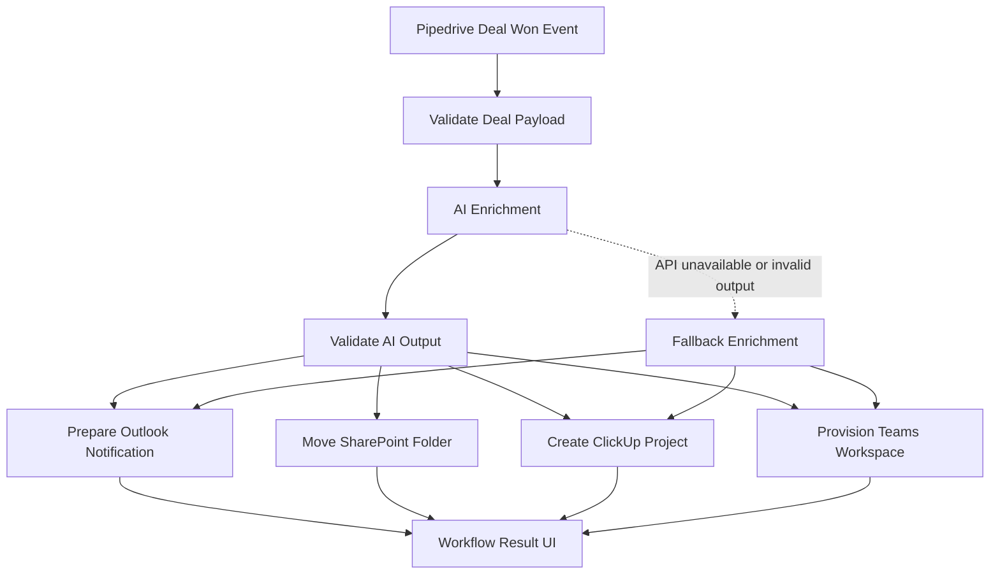

# Workflow Diagram

## Notes

- Validation happens before the workflow starts and again after the AI step.
- The prototype auto-proceeds after validation.
- In production, high-risk deals should pause for approval before email send and downstream provisioning.
