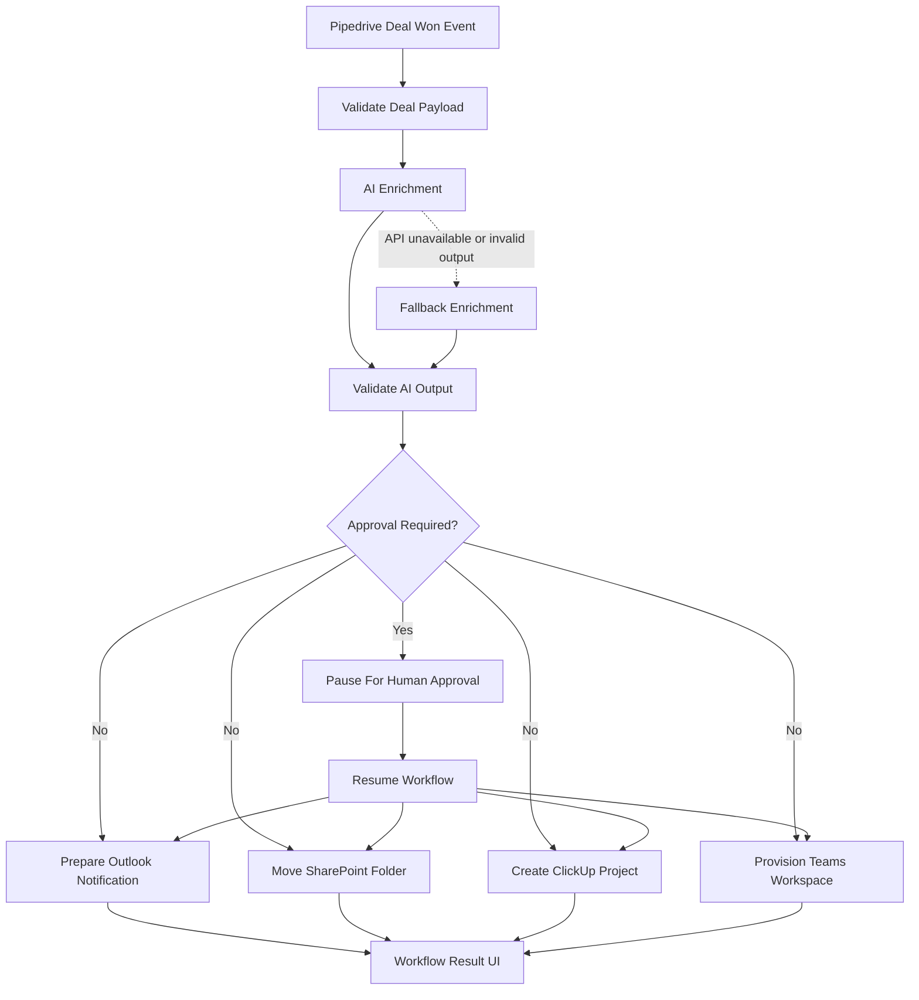

# Workflow Diagram

## Notes

- Validation happens before the workflow starts and again after the AI step.
- The implemented prototype pauses before downstream provisioning when AI falls back or the project is classified as high risk.
- The workflow resumes through a dedicated backend endpoint after a human approval decision is submitted from the UI.
- Outlook, SharePoint, ClickUp, and Teams provisioning run in parallel after approval or on auto-proceeding runs.
- Low and medium risk runs continue automatically without the approval pause.
